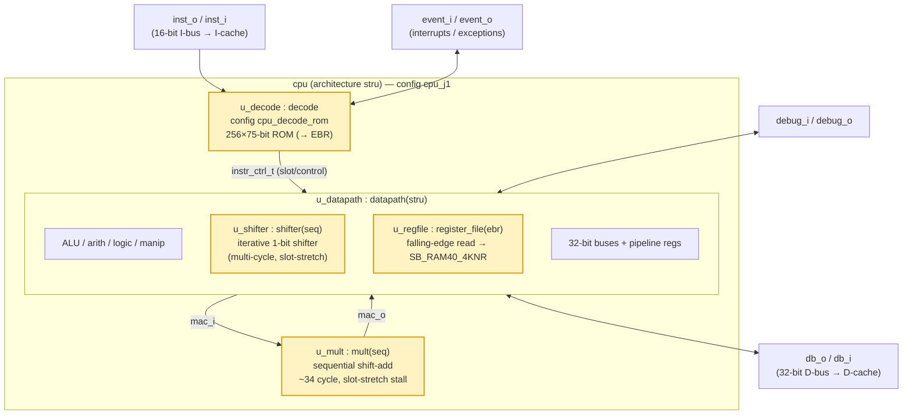

# J1 — Area-Optimised SH-2 Core

> Part of the [CPU Variants](cpu-variants.md) family. Defined as a *delta* against the [J2 baseline](j2.md); see also [J4](j4.md) (SH-4 user-space, MMU + privilege).

## Introduction & goal

**J1 is the small variant of the J-Core CPU.** It runs the *same SH-2 instruction
set* as [J2](j2.md) but trades execution speed for silicon area: the expensive
combinational units are replaced by sequential, iterative ones, and the large
register and decode structures are mapped into on-chip block RAM. The motivating
target is the Lattice **iCE40 up5k** (5,280 LUT4): J1 is the configuration that
makes the core *fit* with headroom for a surrounding SoC.

Design goals:

- **Fit small FPGAs, full stop.** J1's only goal is to fit an iCE40-class device
  with headroom for a surrounding SoC. It is an **FPGA-fit variant, not an ASIC
  area optimisation** — J2 remains the ASIC/general-FPGA baseline, and J1 is free
  to spend whatever hard blocks (EBR, DSP, …) the target FPGA offers if that trims
  LUT4s, even where an ASIC has no equivalent primitive to fall back on.
- **Same ISA, no source forks.** J1 only *re-binds* sub-unit architectures via a
  VHDL configuration; it never edits J2 sources.
- **Accept multi-cycle execution.** Multiply and shift become sequential and stall
  the pipeline via slot-stretch; this is acceptable because area, not throughput,
  is the binding constraint on the intended targets.

The variant is selected by the `cpu_j1` VHDL configuration (simulation) and the
`cpu_synth_j1` configuration (synthesis).

## Block diagram

Differences from [J2](j2.md) are highlighted — every changed unit is a smaller /
sequential replacement bound at the same instance.



## Unit descriptions

Only the units that differ from [J2](j2.md) are area/timing-relevant; the rest are
identical bindings.

| Instance | J1 architecture | vs J2 | Role |
|---|---|---|---|
| `u_decode` | `decode` via `cpu_decode_rom` | `cpu_decode_direct` → **ROM** | The decoder is a **256×75-bit ROM** read on the clock edge instead of a QMC boolean network. On iCE40 the ROM infers into **EBR** block RAM, moving the decode table out of the LUT fabric (decode unit ≈848 → ≈547 LUT4). |
| `u_mult` | `mult(seq)` | `mult(stru)` → **sequential** | A **sequential shift-add multiplier** (~34 cycles for a 32-bit multiply) replaces the Karatsuba array. It removes the array's large LUT footprint and uses **slot-stretch** to freeze the whole pipeline (including the WB stage) while busy, so streaming MAC.L commands are not dropped. |
| `u_shifter` | `shifter(seq)` | `shifter(comb)` → **iterative** | An **iterative 1-bit shifter** replaces the combinational barrel shifter — the single biggest LUT lever in the core (~10%). Multi-cycle shifts stall via datapath-internal slot-stretch on the registered select. |
| `u_regfile` | `register_file(ebr)` | `two_bank` → **EBR** | R0–R15 use a **falling-edge read** that infers an iCE40 `SB_RAM40_4KNR` block RAM, removing ~1044 LUT4 from the fabric. |
| `u_datapath` | `datapath(stru)` | same | Unchanged datapath shell; only its `u_shifter` / `u_regfile` sub-bindings differ. |

### Why these choices

Each substitution targets a different LUT cost centre:

- **Barrel shifter → iterative**: largest combinational block, biggest area win.
- **Array multiply → sequential**: removes a wide multiplier with rare dynamic cost.
- **Decode table & register file → block RAM (EBR)**: moves large memories off the
  LUT fabric entirely on FPGAs that have spare EBR.

Together these brought J1 within the up5k budget. The LUT-only build (`cpu_synth_j1`,
used for ECP5/ASIC J1 synth, which have no SB_MAC16 equivalent) routes at
**≈4945 / 5280 LC (93 %), 9 EBR, 0 DSP, ~12.86 MHz**. A separate J1 *decoder
subset* effort (dropping CAS.L + 8 coprocessor ops to an illegal trap) trims
further while keeping J2/J4 byte-identical.

This EBR usage is a deliberate FPGA-only trade: `cpu_synth_j1` spends iCE40
block RAM to buy back LUT4s that an ASIC flow would have to pay for in gates
instead. J1 is therefore not expected to be smaller than J2 on an ASIC target
— the variant's metric is LUT4 fit on the specific FPGA, not gate count or
ASIC area.

**On the up5k specifically, the default fit build goes further and also spends
the DSP blocks.** `cpu_synth.sh ice40` (the up5k fit gauge) elaborates
`cpu_timing_j1_dsp` → `cpu_synth_j1_dsp`, which binds `mult(ice40dsp)`
(`core/mult_ice40dsp.vhd`) and sets the datapath's `DSP_ALU` generic true so
`core/dsp_arith.vhd` offloads the ALU add/sub onto a free `SB_MAC16` pair —
instead of the LUT-only `mult(seq)` / plain adder. Measured result:
**4626 / 5280 LC (87 %), 9 EBR, 5 / 8 DSP, routed at 14.14 MHz** — smaller and
faster than the LUT-only build, at the cost of consuming 5 of the up5k's 8
hard multiply blocks. ECP5/ASIC J1 synth (`ecp5`/`timing`/`asic` backends)
stays on the LUT-only `cpu_synth_j1`/`cpu_timing_j1`, since those targets have
no SB_MAC16 primitive to spend.

## Timing / latency consequences

J1 is functionally identical to J2 but **slower on multiply and shift**:

- Multiply / MAC: ~34 cycles vs ~2–3, with a full-pipeline slot-stretch stall.
- Dynamic-amount shifts: multi-cycle vs single-cycle.
- Other instructions: unchanged.

The sequential units stall via **slot-stretch** (datapath-/unit-internal pipeline
freeze) rather than the decoder's `next_id_stall`, which keeps the control loop
free of new feedback paths. The `mult(seq)` slot-stretch fix in particular was
required so back-to-back `MAC.L` (issued from the WB stage) are not silently
dropped.

## Build & simulate

```bash
# Decoder: J1 shares J2's base SH-2 spec (ROM binding is a synth/elaboration choice):
make -C decode generate

# Simulate the J1 configuration:
ghdl -e --std=08 -fsynopsys cpu_j1
ghdl -r --std=08 -fsynopsys cpu_j1 ...

# Sequential multiplier unit testbench (12 cases incl. cross-check vs mult(stru)):
cd sim && make TAP=mult_seq_tap

# Synthesise for ECP5 / ASIC (LUT-only cpu_synth_j1, no SB_MAC16):
SYNTH_VARIANT=j1 synth/cpu_synth.sh ecp5

# up5k fit gauge (default: spends SB_MAC16 via cpu_synth_j1_dsp):
SYNTH_VARIANT=j1 synth/cpu_synth.sh ice40
```

## Where to look in the source

- Config: `core/cpu_config.vhd` → `configuration cpu_j1`
- Synth config: `synth/cpu_synth_j1_config.vhd` (`cpu_synth_j1`), ECP5/ASIC only
- up5k DSP synth config: `synth/cpu_synth_j1_dsp_config.vhd` (`cpu_synth_j1_dsp`),
  wired in via `synth/cpu_timing_config.vhd` (`cpu_timing_j1_dsp`) and selected
  by `synth/cpu_synth.sh` for the `ice40` backend
- Sequential multiplier: `core/mult_seq.vhd` (`architecture seq of mult`)
- iCE40-DSP multiplier: `core/mult_ice40dsp.vhd` (`architecture ice40dsp of mult`)
- iCE40-DSP ALU add/sub: `core/dsp_arith.vhd` (`architecture ice40dsp of dsp_arith`)
- Iterative shifter: `shifter(seq)` architecture
- EBR register file: `core/register_file_ebr.vhd`
- ROM decoder: `decode/decode_table_rom.vhd` (256×75-bit ROM, falling-edge read)
