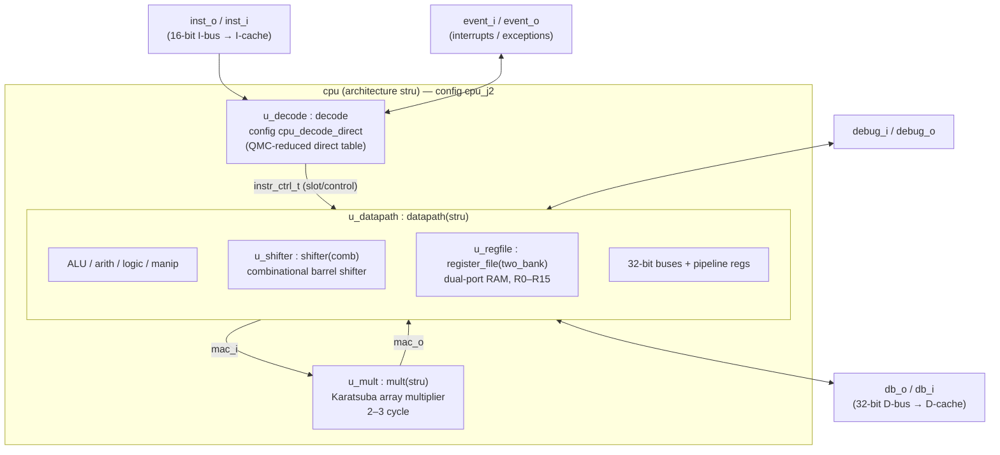

# J2 — Baseline SH-2 Core

> Part of the [CPU Variants](cpu-variants.md) family. See also [J1](j1.md) (area-optimised) and [J4](j4.md) (SH-4 user-space, MMU + privilege).

## Introduction & goal

**J2 is the reference implementation of the J-Core CPU.** It is a clean-room,
open-source 32-bit processor implementing the SH-2 (SuperH-2) instruction set.
Everything else in the family is defined as a *delta* against J2: J1 swaps units
for smaller/slower ones, and J4 adds units on top. For that reason J2 is the
**performance and correctness baseline** — its sources are the ones that must
stay byte-stable (see *The J2 invariant* in [cpu-variants.md](cpu-variants.md)).

Design goals:

- **Full SH-2 ISA compatibility** — runs unmodified SH-2 binaries.
- **Balanced area/performance** — a hardware array multiplier and a combinational
  barrel shifter give single-pass execution of the common arithmetic ops, with no
  multi-cycle stalls outside of multiply/divide/MAC.
- **Be the stable yardstick** — synthesis metrics for J1 and J4 are tracked as
  series relative to J2, so J2's netlist must not drift.

The variant is selected by the `cpu_j2` VHDL configuration (simulation) and the
`cpu_synth_direct` / `cpu_synth_j2` configuration (synthesis).

## Block diagram



## Unit descriptions

| Instance | Bound architecture | Role |
|---|---|---|
| `u_decode` | `decode` via `cpu_decode_direct` | Decodes 16-bit SH-2 opcodes into the pipeline control word (`instr_ctrl_t`) and orchestrates the 5-stage pipeline (`decode_core`). The **direct** table is a Quine–McCluskey-reduced boolean network (`decode_table_direct.vhd`) — fast, fully combinational, moderate LUT cost. |
| `u_mult` | `mult(stru)` | Hardware **Karatsuba array multiplier / MAC** unit. Completes a 32-bit multiply in ~2–3 cycles and is microcode-driven for the MUL/MAC family. Never stalls the pipeline beyond its own latency. |
| `u_datapath` | `datapath(stru)` | The 32-bit execution datapath: ALU (arith/logic/manip), program counter, address generation, the bus muxes, and the pipeline registers spanning EX1–EX3 / WB1–WB3. Hosts the register file and shifter as sub-units. |
| `u_regfile` | `register_file(two_bank)` | R0–R15 general registers implemented as a **dual-port RAM (two-bank)**, the area-efficient default for ASIC/most FPGA targets. |
| `u_shifter` | `shifter(comb)` | **Combinational barrel shifter** — any shift/rotate amount resolves in a single cycle. Largest single contributor of LUT area, but zero shift stalls. |

## Pipeline

J2 is a 5-stage pipeline as described in the top-level `CLAUDE.md`:
**IF → ID → EX1–EX3 → WB1–WB3.** All units above sit inside one clock domain;
the L1 caches handle the CPU↔memory crossing (see *L1 cache* in
[cpu-variants.md](cpu-variants.md)).

## Build & simulate

```bash
# Decoder (shared with J1's spec, base SH-2 only):
make -C decode generate

# Simulate:
ghdl -e --std=08 -fsynopsys cpu_j2
ghdl -r --std=08 -fsynopsys cpu_j2 ...

# Synthesise (baseline; byte-identical to the historical default):
SYNTH_VARIANT=j2 synth/cpu_synth.sh asic
```

## Where to look in the source

- Top entity: `core/cpu.vhd` (`architecture stru`)
- Config: `core/cpu_config.vhd` → `configuration cpu_j2`
- Synth config: `synth/cpu_synth_config.vhd` (`cpu_synth_direct` / `cpu_synth_j2`)
- Multiplier: `core/mult.vhm` (`architecture stru`)
- Datapath: `core/datapath.vhm`; register file: `core/register_file_two_bank.vhd`
