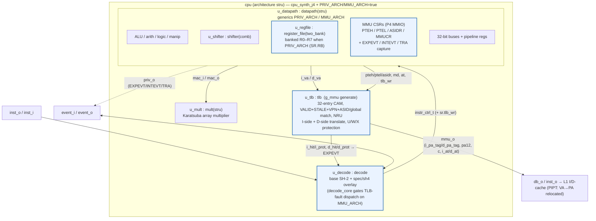
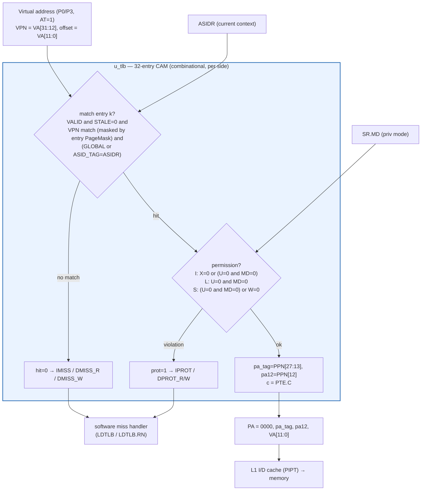

# J4 — SH-4 Privileged Core (MMU + banked registers)

> Part of the [CPU Variants](cpu-variants.md) family. Built *additively* on top of the [J2 baseline](j2.md); contrast with [J1](j1.md) (area-optimised).

## Introduction & goal

**J4 targets the SH-4 *user-space* ABI — run SH-4 user binaries at the best
performance-per-watt and performance-per-area — without committing to bug-for-bug
SH-4 *kernel-space* compatibility.** It adds exactly the privileged hardware needed
to *host* user space (supervisor/user mode, an MMU with a hardware TLB, banked
registers, precise exceptions) on top of the [J2](j2.md) SH-2 datapath. Where SH-4
already defines a privileged mechanism, J4 follows it (because it serves the
user-space target and is often cheaper than the SH-2 inheritance); where it does
not matter to user space, J4 is free to simplify.

The exception machine is the clearest example. J4 switches from the **SH-2 stack
model** it inherits from J2 to the **SH-4 register model** — this is *convergence
toward* SH-4, not away from it (see *Exception model* below). The win is twofold:
it is what an SH-4 OS expects, **and** it removes the stack pushes and vector-table
memory read that the SH-2 model performs on every exception — directly serving the
perf-per-watt / perf-per-area goal.

The SH-4 features below are *implemented and tested today* — not future stubs.
They are gated by two entity generics so the core can be elaborated either as plain
J2 or as the full privileged machine from the same sources:

| Generic | Default | When `true` enables |
|---|---|---|
| `PRIV_ARCH` | `false` | SH-4 privilege: `SR.MD/RB/BL`, banked R0–R7, register-model exception entry/return, `EXPEVT`/`INTEVT`/`TRA` capture (`priv_o`). |
| `MMU_ARCH` | `false` | MMU on top of `PRIV_ARCH`: the `tlb` CAM, address translation (`AT`), MMU control registers (PTEH/PTEL/ASIDR/MMUCR), TLB-fault exception dispatch, and physical PA tags to the caches (`mmu_o`). `MMU_ARCH` is subordinate to `PRIV_ARCH`. |

Both generics default `false`, so the **bare `cpu_j4` configuration is
byte-identical to [J2](j2.md)**. The SH-4 hardware only appears when a
configuration turns the generics on (see the configuration matrix below). This is
how J4 keeps the *J2 invariant* — J2's netlist never changes — while still
shipping a real privileged core.

Design goals:

- **SH-4 user-space compatibility.** Run SH-4 user binaries faithfully; provide
  the MMU + privilege needed to host them under an OS.
- **Performance per watt and per area.** The privileged hardware is sized to that
  metric — e.g. the SH-4 register-model exception path avoids the SH-2 model's
  stack pushes and vector-table read — rather than to full kernel-space fidelity.
- **Bug-for-bug SH-4 kernel compatibility is a non-goal.** J4 adopts SH-4
  privileged *mechanisms* (register-model exceptions, MMU CSRs) where useful, but
  does not promise to replicate every SH-4 supervisor detail; only the
  user-visible architecture is held to SH-4.
- **Zero-cost when off.** `PRIV_ARCH=false`/`MMU_ARCH=false` elaborates
  byte-identically to J2; every SH-4 addition lives inside `if PRIV_ARCH`/
  `if MMU_ARCH` guards or in additive files (`spec/sh4/`, `core/tlb.vhd`).
- **Synthesizable, not just simulatable.** The MMU hardware is `check -assert`-gated
  in the j4c ASIC flow (see *Synthesis* below).

## Configuration matrix

| Configuration | Of | `PRIV_ARCH` | `MMU_ARCH` | Purpose |
|---|---|---|---|---|
| `cpu_j4` | `cpu` (sim) | false | false | Bare J4 == J2; parity build |
| `cpu_sim` | `cpu` (sim) | (decoder `MMU_ARCH=true`) | — | Functional sim build; keeps TLB decode logic live |
| `cpu_synth_j4` | `cpu` | false | false | J4 baseline synth (== J2) |
| `cpu_synth_j4_priv` | `cpu` | **true** | false | Privileged J4 (banked regs, exceptions) — area flows |
| `cpu_cache_timing_j4_priv` | `cpu_cache_timing_top` | **true** | false | J4+cache, privileged, timing flow |
| `cpu_cache_timing_j4_priv_mmu` | `cpu_cache_timing_top` | **true** | **true** | **Full J4+MMU+cache** (the `j4c` ASIC build) |

Sources: `core/cpu_config.vhd` (`cpu_j4`, `cpu_sim`), `synth/cpu_synth_j4_config.vhd`
(`cpu_synth_j4`, `cpu_synth_j4_priv`), `synth/cpu_cache_timing_config.vhd`
(`cpu_cache_timing_j4_priv`, `cpu_cache_timing_j4_priv_mmu`).

## Block diagram

Shown with `MMU_ARCH=true` — the `g_mmu` generate block in `core/cpu.vhd`
instantiates the real `u_tlb` and the TLB-fault → EXPEVT logic. With the generics
`false`, the highlighted blocks are pruned and the core collapses to [J2](j2.md).



## Unit descriptions

The base units (`mult(stru)`, `shifter(comb)`, direct decoder, datapath shell) are
identical to [J2](j2.md). The SH-4 additions:

| Unit / block | Where | Role |
|---|---|---|
| **`tlb`** (`u_tlb`) | `core/tlb.vhd`, instantiated in `core/cpu.vhd` under `g_mmu : if MMU_ARCH generate` | **32-entry associative TLB CAM**. Parallel I-side and D-side combinational match (`VALID ∧ STALE=0 ∧ (VPN & PageMask) ∧ (GLOBAL ∨ ASID)`) — the VPN compare is **masked by the entry's PageMask** (`PTEL[11:8]`), enabling variable page sizes from 4 KB (pm=0) through 16 KB, 64 KB, 1 MB, up to 1 GB. On a hit the relocation offset width also varies by pm so the sub-page VA bits are passed through to form the correct PA. Produces `{i,d}_hit`, the 15-bit `{i,d}_pa_tag` (PA[27:13]), `{i,d}_pa12` (PA[12], for PIPT relocation), `{i,d}_c` (cacheability), and `{i,d}_prot` (U/W/X enforcement). Clocked LDTLB writes from PTEH/PTEL/ASIDR with **NRU** replacement, and a `ti` flush. **See [tlb.md](tlb.md) for the full software/security architecture.** |
| **Banked register file** | `core/register_file_two_bank.vhd` (`BANKED` ⇐ `PRIV_ARCH`) | R0–R7 gain a second bank selected by `SR.RB`; `datapath` does `bank_remap(num, sr.md, sr.rb)`. With `PRIV_ARCH=false` the bank index folds to a constant, so J2 is byte-identical. `STC Rm_BANK,Rn` reads the *inactive* bank. |
| **MMU CSRs + exception capture** | `core/datapath.vhm` under `if PRIV_ARCH` / `if MMU_ARCH` | P4-MMIO MMU control registers (PTEH/PTEL/ASIDR/MMUCR) and capture of `EXPEVT`/`INTEVT`/`TRA`, exported on `priv_o`; MMU register state exported to the TLB. |
| **TLB-fault dispatch** | `decode/decode_core.vhm` under `g_texc : if MMU_ARCH` | Turns TLB `hit`/`prot` results into SH-4 exception entries: IMISS→`0x040`, DMISS_R→`0x060`, DMISS_W→`0x080`, IPROT→`0x0A0`, DPROT_{R,W}→`0x0C0` (mapped in `core/cpu.vhd`). Exception hold uses `SR.RB`/`SR.BL` to block re-entrancy. |
| **D-store fault squash** | `core/cpu.vhd` `g_dstore_squash : if MMU_ARCH` | A store that is itself TLB-faulting is demoted from write to read so it cannot corrupt memory before the fault is taken. |
| **SH-4 decoder overlay** | `decode/gen-go/spec/sh4/` | `make -C decode generate-j4` merges the overlay onto the base spec, adding the SH-4 opcodes (next section). |

## TLB architecture (quick view)

The TLB is a 32-entry, fully-associative, **software-loaded** CAM. Every access (I-fetch and D-load/store, independently and in parallel) presents its virtual address; the TLB combinationally selects a matching entry via a **masked VPN compare** (the VPN bits active in the compare are gated by the entry's `PageMask` field at `PTEL[11:8]`), **enforces the page permissions**, and — for a hit — relocates the virtual address to the physical address so the L1 caches are **physically indexed (PIPT)**. Variable page sizes from 4 KB (pm=0) to 1 GB are supported; the relocation offset width scales with pm so sub-page VA bits are preserved. There is no hardware page-table walker: on a miss the core raises an access-type exception and a privileged software handler installs the entry with `LDTLB`/`LDTLB.RN`.



**Quick description.** A lookup hits only when the entry is `VALID`, **not** `STALE` (a software soft-invalidate / revocation marker, enforced in hardware), its `VPN` matches, and either it is `GLOBAL` (a kernel-shared page, ASID-agnostic) or its `ASID_TAG` equals the current `ASIDR` (so one tenant's entries are invisible to another). On a hit the permission bits are checked against the access type and `SR.MD`: instruction fetch needs `X`; a user (`MD=0`) access additionally needs `U`; a store needs `W` (enforced even for the kernel). A failure raises the matching access-type exception; the offending memory effect is suppressed (a faulting store is demoted to a non-mutating read). On success the entry's `PPN` replaces `VA[27:12]` to form the 28-bit physical address, which indexes the PIPT L1 caches; `PTE.C` selects cacheable vs. uncached-bypass. **For the full software-and-security view — the kernel's contract, the isolation model, the threat model, and the per-bit semantics — see [tlb.md](tlb.md).**

## ISA additions (SH-4 overlay)

The overlay under `decode/gen-go/spec/sh4/` is **populated** (the older "empty /
`.gitkeep` only" description is stale). It adds:

- **`mmu.toml`** — MMU control & TLB ops: `LDC/STC` for **PTEH, PTEL, ASIDR**,
  read-only **TSBPTR** (`STC TSBPTR,Rn`), **`LDTLB`** (install entry from
  PTEH/PTEL/ASIDR), and **`LDTLB.RN`** (non-delayed atomic load-TLB-and-return, fused for
  handler atomicity). Also pins bit 11 in `Break`/`Reset` debug opcodes so they
  don't alias the TLB exception nibbles `0xA`/`0xB`.
- **`bank.toml`** — banked-register moves: `LDC Rm,Rn_BANK` and `STC Rm_BANK,Rn`
  (register–register forms; the multi-slot `.L` variants are deferred to avoid
  overflowing the ~256-slot microcode ROM).
- **`exceptions.toml`** — the **SH-4 register-model** exception machine (detailed
  in *Exception model* below). It *overrides the base SH-2 stack-model* `Interrupt`
  / `Error` / `RTE` / illegal / `TRAPA` instructions by name, switching entry/return
  to `SPC`/`SSR` registers and fixed vectors.

Regenerating with the overlay is a *transient* synth/test step — the committed base
decode tables (used by J1/J2) are never modified; CI asserts byte-identity after a
plain `make -C decode generate`.

## Exception model: SH-2 stack (J2) → SH-4 register (J4)

This is the most visible J4↔J2 difference, and the one most often misread, so it is
worth spelling out. The two models differ in **where the interrupted context is
saved** and **how the handler address is found**.

### J2 — SH-2 stack model (base `decode/gen-go/spec/system.toml`, `branch.toml`)

On an exception/interrupt the microcode:

1. pushes `SR` to the R15 stack (`[R15-4] ← SR`, a 32-bit memory **write**),
2. pushes `PC` to the R15 stack (`[R15-8] ← PC`, a second 32-bit memory **write**),
3. **reads** the handler address from the in-memory vector table (`[VBR + vec×4]`),
4. jumps to it.

`RTE` reverses it: two 32-bit **reads** pop `PC` and `SR` back off R15, then a
delayed branch. So every entry/exit touches memory 3–4 times (stack + vector table).

### J4 — SH-4 register model (`decode/gen-go/spec/sh4/exceptions.toml`)

The same events instead:

1. `SPC ← PC` (adjusted) — a dedicated register, no memory,
2. `SSR ← SR` — a dedicated register, no memory,
3. capture the SH-4 cause code into `EXPEVT` / `INTEVT` / `TRA`,
4. take a **direct fixed-vector** jump: `PC ← VBR + 0x100` (general exceptions) or
   `VBR + 0x600` (interrupts) — no vector-table read.

`RTE` restores `PC ← SPC`, `SR ← SSR` and takes the delayed branch — register reads
only, no stack pops. `SPC`/`SSR` are architectural registers (regfile slots 21/22)
that software reads/writes with `STC/LDC SPC,Rn` / `SSR,Rn`, exactly as on SH-4.
`LDTLB.RN` is a fused install-TLB-entry-and-return that, unlike `RTE`, takes NO
delay slot — it uses the same non-delayed redirect tail as exception entry (install +
SR restore, then issue-fetch + dispatch), giving an atomic miss-handler exit with no
wasted delay-slot nop.

### Why J4 uses the SH-4 register model

| | SH-2 stack model (J2) | SH-4 register model (J4) |
|---|---|---|
| Save PC/SR | 2 stack memory writes | `SPC`/`SSR` registers (0 memory) |
| Handler address | vector-table memory read | fixed vector (`VBR+0x100/0x600`) |
| Cause reporting | implicit (vector number) | explicit `EXPEVT`/`INTEVT`/`TRA` |
| `RTE` | 2 stack memory reads | `SPC`/`SSR` register reads |
| Memory traffic / entry+exit | 3–4 accesses | none |

The register model is **what an SH-4 OS expects** (so it serves the user-space
target via OS compatibility) *and* it removes 3–4 memory accesses from every
exception — lower latency and energy, which is exactly the perf-per-watt /
perf-per-area goal. This is therefore **convergence toward SH-4**, replacing the
SH-2 mechanism J4 inherited from J2 — not a divergence from SH-4. (Where J4 does
*not* promise SH-4 fidelity is the broader kernel-space surface — full CSR set,
exact priorities — which user-space code never sees.)

## Synthesis cost

The MMU hardware is synthesizable and `check -assert`-clean in the `j4c` ASIC flow
(`SYNTH_VARIANT=j4c`, config `cpu_cache_timing_j4_priv_mmu`). Measured cell counts
(yosys flatten/stat, generic cells):

| Build | Flat cells | Δ |
|---|---:|---|
| j4c PRIV-only (`MMU_ARCH=false`) | 542,091 | — |
| j4c PRIV+MMU (`MMU_ARCH=true`) | 551,106 | **+9,015 (+1.66 %)** |

The +9k cells are the TLB CAM + NRU + PIPT relocation seam + MMU CSR file + D-store squash +
exception-detect. (Full account: `.superpowers/sdd/mmu-asic-j4c-report.md`, which
also documents a real `p4_sel_v` read-before-write defect that only surfaced once
the MMU was actually synthesized.) Fmax is reported by the CI ASIC timing flow, not
locally.

## Test & CI coverage

J4's privilege + MMU machinery is exercised by a dedicated SH-2-asm regression
suite built with `CONFIG_PRIV_ARCH=1 CONFIG_MMU_ARCH=1`:

- **Privilege / banking / exceptions:** `privmode`, `banktest`, `exctest`,
  `excguard`, `trapatest`, `pm3vec`, `pm3guard`, `rteredir`.
- **MMU / TLB:** `mmureg`, `mmuguard`, `mmuxlate`, `mmurte`, `mmustore`,
  `mmuimiss`, `mmusr`, `mmufault`, `mmuldtlbr`, `mmutsb`, `mmuidx`, `mmustres`,
  `mmustr2`, `mmurun`, `mmuirun`, `mmuainc`, `mmuainc2`; and (under
  `cpu_cache_tb`) `mmuicolor`/`mmudcbit` (PTE C-bit cacheability) and
  `mmureloc`/`mmurelocif`/`mmurelocbp` (PIPT VA→PA address relocation:
  D-data, I-fetch, and C=0 uncacheable bypass).
- **Unit TB:** `sim/tlb_match_tb.vhd` (associative install/lookup), `sim/tests/tlbwalk.c`.

CI runs the full set in `.github/workflows/full-regression.yml`
(`make -C decode generate-j4` then the `CONFIG_PRIV_ARCH=1 CONFIG_MMU_ARCH=1`
guard loop). `pr-quick.yml` elaborates all three decoder architectures against the
J4 overlay and verifies the base tables are untouched.

## Build & simulate

```bash
# Generate the J4 (SH-4 overlay) decoder:
make -C decode generate-j4

# Functional sim with privilege + MMU enabled:
make -C sim ... CONFIG_PRIV_ARCH=1 CONFIG_MMU_ARCH=1   # build cpu_tb
make CONFIG_PRIV_ARCH=1 CONFIG_MMU_ARCH=1 -C tests mmuxlate.img
ghdl -r --std=08 -fsynopsys cpu_j4 ...                 # bare (==J2) elaboration

# Full J4+MMU+cache ASIC synthesis (check -assert gated):
SYNTH_VARIANT=j4c synth/cpu_synth.sh asic
```

## Where to look in the source

- TLB CAM: `core/tlb.vhd` (32-entry, I/D combinational match, NRU)
- MMU wiring / fault → EXPEVT: `core/cpu.vhd` (`g_mmu`, `g_dstore_squash`)
- Privilege + CSRs + exception capture: `core/datapath.vhm` (`PRIV_ARCH`/`MMU_ARCH` guards)
- TLB-fault dispatch: `decode/decode_core.vhm` (`g_texc`)
- Banked registers: `core/register_file_two_bank.vhd` (`BANKED`)
- SH-4 ISA overlay: `decode/gen-go/spec/sh4/{mmu,bank,exceptions}.toml`
- Configs: `core/cpu_config.vhd`, `synth/cpu_synth_j4_config.vhd`, `synth/cpu_cache_timing_config.vhd`
- Status report: `.superpowers/sdd/mmu-asic-j4c-report.md`, `.superpowers/sdd/task-7-report.md`
