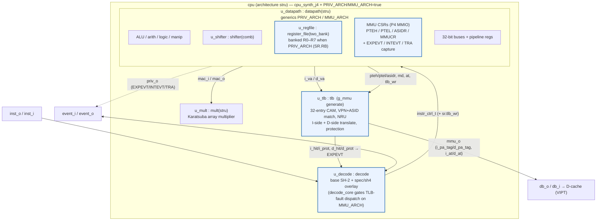

# J4 — SH-4 Privileged Core (MMU + banked registers)

> Part of the [CPU Variants](cpu-variants.md) family. Built *additively* on top of the [J2 baseline](j2.md); contrast with [J1](j1.md) (area-optimised).

## Introduction & goal

**J4 targets the SH-4 *user-space* ABI — run SH-4 user binaries at the best
performance-per-watt and performance-per-area — without committing to SH-4
*kernel-space* compatibility.** It adds exactly the privileged hardware needed to
*host* user space (supervisor/user mode, an MMU with a hardware TLB, banked
registers, precise exceptions) on top of the [J2](j2.md) SH-2 datapath, but the
supervisor model itself is J-Core's own design, deliberately **not** a bug-for-bug
SH-4 kernel.

The clearest example of that boundary is the exception machine: J4 uses a
**register-model** entry/return (`SPC`/`SSR`, fixed-vector jump, no stack access)
rather than SH-4's stack-based supervisor model. A user-space SH-4 program never
observes the difference; an SH-4 kernel would. That divergence is intentional —
kernel-space SH-4 compatibility is a *non-goal*, and dropping it buys cheaper,
faster privileged hardware, which is what the perf-per-area / perf-per-watt target
rewards.

The SH-4 features below are *implemented and tested today* — not future stubs.
They are gated by two entity generics so the core can be elaborated either as plain
J2 or as the full privileged machine from the same sources:

| Generic | Default | When `true` enables |
|---|---|---|
| `PRIV_ARCH` | `false` | SH-4 privilege: `SR.MD/RB/BL`, banked R0–R7, register-model exception entry/return, `EXPEVT`/`INTEVT`/`TRA` capture (`priv_o`). |
| `MMU_ARCH` | `false` | MMU on top of `PRIV_ARCH`: the `tlb` CAM, address translation (`AT`), MMU control registers (PTEH/PTEL/ASIDR/MMUCR), TLB-fault exception dispatch, and physical PA tags to the caches (`mmu_o`). `MMU_ARCH` is subordinate to `PRIV_ARCH`. |

Both generics default `false`, so the **bare `cpu_j4` configuration is
byte-identical to [J2](j2.md)**. The SH-4 hardware only appears when a
configuration turns the generics on (see the configuration matrix below). This is
how J4 keeps the *J2 invariant* — J2's netlist never changes — while still
shipping a real privileged core.

Design goals:

- **SH-4 user-space compatibility.** Run SH-4 user binaries faithfully; provide
  the MMU + privilege needed to host them under an OS.
- **Performance per watt and per area.** The privileged hardware is sized to that
  metric — e.g. the register-model exception path is cheaper than an SH-4
  stack-model one — rather than to full kernel-space fidelity.
- **Kernel-space SH-4 compatibility is a non-goal.** The supervisor model is
  J-Core's own; only the user-visible architecture tracks SH-4.
- **Zero-cost when off.** `PRIV_ARCH=false`/`MMU_ARCH=false` elaborates
  byte-identically to J2; every SH-4 addition lives inside `if PRIV_ARCH`/
  `if MMU_ARCH` guards or in additive files (`spec/sh4/`, `core/tlb.vhd`).
- **Synthesizable, not just simulatable.** The MMU hardware is `check -assert`-gated
  in the j4c ASIC flow (see *Synthesis* below).

## Configuration matrix

| Configuration | Of | `PRIV_ARCH` | `MMU_ARCH` | Purpose |
|---|---|---|---|---|
| `cpu_j4` | `cpu` (sim) | false | false | Bare J4 == J2; parity build |
| `cpu_sim` | `cpu` (sim) | (decoder `MMU_ARCH=true`) | — | Functional sim build; keeps TLB decode logic live |
| `cpu_synth_j4` | `cpu` | false | false | J4 baseline synth (== J2) |
| `cpu_synth_j4_priv` | `cpu` | **true** | false | Privileged J4 (banked regs, exceptions) — area flows |
| `cpu_cache_timing_j4_priv` | `cpu_cache_timing_top` | **true** | false | J4+cache, privileged, timing flow |
| `cpu_cache_timing_j4_priv_mmu` | `cpu_cache_timing_top` | **true** | **true** | **Full J4+MMU+cache** (the `j4c` ASIC build) |

Sources: `core/cpu_config.vhd` (`cpu_j4`, `cpu_sim`), `synth/cpu_synth_j4_config.vhd`
(`cpu_synth_j4`, `cpu_synth_j4_priv`), `synth/cpu_cache_timing_config.vhd`
(`cpu_cache_timing_j4_priv`, `cpu_cache_timing_j4_priv_mmu`).

## Block diagram

Shown with `MMU_ARCH=true` — the `g_mmu` generate block in `core/cpu.vhd`
instantiates the real `u_tlb` and the TLB-fault → EXPEVT logic. With the generics
`false`, the highlighted blocks are pruned and the core collapses to [J2](j2.md).



## Unit descriptions

The base units (`mult(stru)`, `shifter(comb)`, direct decoder, datapath shell) are
identical to [J2](j2.md). The SH-4 additions:

| Unit / block | Where | Role |
|---|---|---|
| **`tlb`** (`u_tlb`) | `core/tlb.vhd`, instantiated in `core/cpu.vhd` under `g_mmu : if MMU_ARCH generate` | **32-entry associative TLB CAM**. Parallel I-side and D-side combinational VPN+ASID match producing `{i,d}_hit`, a 15-bit `{i,d}_pa_tag`, and `{i,d}_prot`. Clocked LDTLB writes from PTEH/PTEL/ASIDR with **NRU** replacement, and a `ti` flush. Ports include `asid`, `md`, `at`, `tlb_wr`. |
| **Banked register file** | `core/register_file_two_bank.vhd` (`BANKED` ⇐ `PRIV_ARCH`) | R0–R7 gain a second bank selected by `SR.RB`; `datapath` does `bank_remap(num, sr.md, sr.rb)`. With `PRIV_ARCH=false` the bank index folds to a constant, so J2 is byte-identical. `STC Rm_BANK,Rn` reads the *inactive* bank. |
| **MMU CSRs + exception capture** | `core/datapath.vhm` under `if PRIV_ARCH` / `if MMU_ARCH` | P4-MMIO MMU control registers (PTEH/PTEL/ASIDR/MMUCR) and capture of `EXPEVT`/`INTEVT`/`TRA`, exported on `priv_o`; MMU register state exported to the TLB. |
| **TLB-fault dispatch** | `decode/decode_core.vhm` under `g_texc : if MMU_ARCH` | Turns TLB `hit`/`prot` results into SH-4 exception entries: IMISS→`0x040`, DMISS_R→`0x060`, DMISS_W→`0x080`, IPROT→`0x0A0`, DPROT_{R,W}→`0x0C0` (mapped in `core/cpu.vhd`). Exception hold uses `SR.RB`/`SR.BL` to block re-entrancy. |
| **D-store fault squash** | `core/cpu.vhd` `g_dstore_squash : if MMU_ARCH` | A store that is itself TLB-faulting is demoted from write to read so it cannot corrupt memory before the fault is taken. |
| **SH-4 decoder overlay** | `decode/gen-go/spec/sh4/` | `make -C decode generate-j4` merges the overlay onto the base spec, adding the SH-4 opcodes (next section). |

## ISA additions (SH-4 overlay)

The overlay under `decode/gen-go/spec/sh4/` is **populated** (the older "empty /
`.gitkeep` only" description is stale). It adds:

- **`mmu.toml`** — MMU control & TLB ops: `LDC/STC` for **PTEH, PTEL, ASIDR**,
  read-only **TSBPTR** (`STC TSBPTR,Rn`), **`LDTLB`** (install entry from
  PTEH/PTEL/ASIDR), and **`LDTLB.R`** (atomic load-TLB-and-return, fused for
  handler atomicity). Also pins bit 11 in `Break`/`Reset` debug opcodes so they
  don't alias the TLB exception nibbles `0xA`/`0xB`.
- **`bank.toml`** — banked-register moves: `LDC Rm,Rn_BANK` and `STC Rm_BANK,Rn`
  (register–register forms; the multi-slot `.L` variants are deferred to avoid
  overflowing the ~256-slot microcode ROM).
- **`exceptions.toml`** — the **register-model** exception machine: on entry
  `SPC←PC`, `SSR←SR`, cause → `EXPEVT`/`INTEVT`/`TRA`, then a fixed-vector jump
  (`VBR+0x100` errors, `VBR+0x600` interrupts) with **no stack memory access**;
  `RTE` restores `PC←SPC`, `SR←SSR`. This is the deliberate kernel-space
  divergence from SH-4 (and from J2's stack-based model): invisible to user-space
  code, cheaper in area/power than a stack-model handler entry.

Regenerating with the overlay is a *transient* synth/test step — the committed base
decode tables (used by J1/J2) are never modified; CI asserts byte-identity after a
plain `make -C decode generate`.

## Synthesis cost

The MMU hardware is synthesizable and `check -assert`-clean in the `j4c` ASIC flow
(`SYNTH_VARIANT=j4c`, config `cpu_cache_timing_j4_priv_mmu`). Measured cell counts
(yosys flatten/stat, generic cells):

| Build | Flat cells | Δ |
|---|---:|---|
| j4c PRIV-only (`MMU_ARCH=false`) | 542,091 | — |
| j4c PRIV+MMU (`MMU_ARCH=true`) | 551,106 | **+9,015 (+1.66 %)** |

The +9k cells are the TLB CAM + NRU + VIPT seam + MMU CSR file + D-store squash +
exception-detect. (Full account: `.superpowers/sdd/mmu-asic-j4c-report.md`, which
also documents a real `p4_sel_v` read-before-write defect that only surfaced once
the MMU was actually synthesized.) Fmax is reported by the CI ASIC timing flow, not
locally.

## Test & CI coverage

J4's privilege + MMU machinery is exercised by a dedicated SH-2-asm regression
suite built with `CONFIG_PRIV_ARCH=1 CONFIG_MMU_ARCH=1`:

- **Privilege / banking / exceptions:** `privmode`, `banktest`, `exctest`,
  `excguard`, `trapatest`, `pm3vec`, `pm3guard`, `rteredir`.
- **MMU / TLB:** `mmureg`, `mmuguard`, `mmuxlate`, `mmurte`, `mmustore`,
  `mmuimiss`, `mmusr`, `mmufault`, `mmuldtlbr`, `mmutsb`, `mmuidx`, `mmustres`,
  `mmustr2`, `mmurun`, `mmuirun`, `mmuainc`, `mmuainc2`; `mmucolor` (under
  `cpu_cache_tb`, VIPT cache colour).
- **Unit TB:** `sim/tlb_match_tb.vhd` (associative install/lookup), `sim/tests/tlbwalk.c`.

CI runs the full set in `.github/workflows/full-regression.yml`
(`make -C decode generate-j4` then the `CONFIG_PRIV_ARCH=1 CONFIG_MMU_ARCH=1`
guard loop). `pr-quick.yml` elaborates all three decoder architectures against the
J4 overlay and verifies the base tables are untouched.

## Build & simulate

```bash
# Generate the J4 (SH-4 overlay) decoder:
make -C decode generate-j4

# Functional sim with privilege + MMU enabled:
make -C sim ... CONFIG_PRIV_ARCH=1 CONFIG_MMU_ARCH=1   # build cpu_tb
make CONFIG_PRIV_ARCH=1 CONFIG_MMU_ARCH=1 -C tests mmuxlate.img
ghdl -r --std=08 -fsynopsys cpu_j4 ...                 # bare (==J2) elaboration

# Full J4+MMU+cache ASIC synthesis (check -assert gated):
SYNTH_VARIANT=j4c synth/cpu_synth.sh asic
```

## Where to look in the source

- TLB CAM: `core/tlb.vhd` (32-entry, I/D combinational match, NRU)
- MMU wiring / fault → EXPEVT: `core/cpu.vhd` (`g_mmu`, `g_dstore_squash`)
- Privilege + CSRs + exception capture: `core/datapath.vhm` (`PRIV_ARCH`/`MMU_ARCH` guards)
- TLB-fault dispatch: `decode/decode_core.vhm` (`g_texc`)
- Banked registers: `core/register_file_two_bank.vhd` (`BANKED`)
- SH-4 ISA overlay: `decode/gen-go/spec/sh4/{mmu,bank,exceptions}.toml`
- Configs: `core/cpu_config.vhd`, `synth/cpu_synth_j4_config.vhd`, `synth/cpu_cache_timing_config.vhd`
- Status report: `.superpowers/sdd/mmu-asic-j4c-report.md`, `.superpowers/sdd/task-7-report.md`
